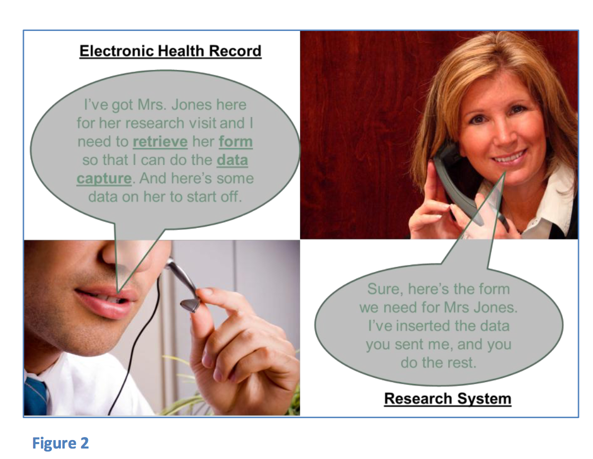

# Healthcare Link 用户手册
## 临床研究数据捕获/采集/获取
## 简介
Healthcare Link 是CDISC发起的一个项目，总体目标是只采集一次数据(以某种能够满足多个下游应用系统需求的行业标准格式，同时也能够提高数据质量和
    患者安全)，让医生、医疗机构更方便地参与到临床研究中来。

Healthcare link在技术方面的进展主要来自于CDISC 和IHE组织的合作。Healthcare Link项目想要为医疗机构的临床研究参与人员打造
一个从方案可行性、报表到提交整个过程的一体式/整合式系统。该用户手册实现了其中一个目标：临床研究数据在医疗机构中的捕获/采集/获取。

当前研究数据获取的状态如图一所示。尽管有了一些进展，医疗机构内研究数据的采集仍然还是通过一堆乱七八糟的文本，各种EDC系统来收集的。同时EHR
电子病历系统是整个医疗流程自动化过程中的核心系统。为了研究而采集的大多数数据已经包含在EHR之内，这些数据与研究用的文本或EDC系统中的数据是重复的。
Healthcare Link中将EHR作为医护人员使用的唯一界面，通过支持与在数据采集临床试验自动化和数据管理中发挥重要作用的EDC系统之间自动化的工作流程提供一个一体式的系统。

CDISC与IHE 质量、研究和公共卫生域紧密配合形成了一些集成规范用于实现互操作性。这些Healthcare Link规范的开发遵循以下原则：
* 临床研究的话采用CDISC标准，医疗采用HL7
* 临床研究自动化采用EDC系统，医疗流程自动化采用EHR
* 考虑了医疗和研究两方面各自的法律法规，研究方面遵循21 CFR Part11，医疗方面遵循HIPPA
* 着眼于医疗机构的需求，将临床研究的工作流程集成到EHR系统当中去
* 开发一种集成的方式使得在保留和扩展EDC系统作用的前提下，EHR系统能够易于支持临床研究

不同于诸如EHR或EDC的单系统解决方案，Healthcare Link从定义上、设计上就是一个多系统的解决方案。两个或以上的系统间集成要求规范中解决每个系统的角色，定义好每个系统执行的步骤。
因此，用户手册从不同的角度来考虑以调整每个系统所发挥的互补作用。

假定在IHE集成规范中都规定了Healthcare Link中的每个子系统的角色。这些IHE规范(RFD CRD等)描述了要有哪些角色，每个系统要执行的交易/事务。在Healthcare Link的
解决方案中至少有三个独立的系统参与其中：一个EHR系统，一个EDC系统和一个归档库。在某个具体应用中，要支持某个临床研究，可能会涉及多个EHR系统，但通常只涉及一个EDC系统和一个归档库。
反之，一个医疗机构只有一个EHR系统，要完成不同赞助方的多个研究的话可能会与多个不同的EDC系统发生交互。

## 范围
该手册的目的不在于取代实施这些规范来构建一个Healthcare Link解决方案中的技术细节，而是给出一些所涉及到的系统:EHR、EDC和归档系统应如何approach an implementation的额外信息
IHE 集成规范阐述了如何实现EHR和EDC系统间的互联互通。相关规范请参考[cdisc_healthcare_link_p rofiles](http://www.cdisc.org/system/files/all/standard_category/application/pdf/cdisc_healthcare_link_p rofiles.pdf.)

这些IHE 规范中同时包含了问题域和技术信息。Volume 1第一卷适合非技术人员，包含了一个实施前后状态的用例场景的文本描述。Volume 2&3 第2、3卷是技术文档，技术人员如何才
能够构建这样一个跨系统的互联互通的解决方案。打算实施的人员应该通读整个规范。该用户手册将不再赘述规范中的系统角色和交易/事务规范，但将更详细地讨论所涉及的系统如何完成这样的
任务，以及使用Healthca Link开展这样一个项目需要哪些工作。

在如下两个IHE 规范中定义了EHR 和EDC 系统间事务：数据采集的检索表单RFD——介绍了一些表单；临床研究文档——用EHR中的数据填充表单。Healthcare link项目的工作成果还包含其他规范，但RFD和CRD是核心部分，也是最成熟和最可实施的部分。RFD和CRD一起使用能够让EHR系统用户获得预先就填充了一部分值的eCRF，可以在EHR的系统界面中完成整个表单的填写。但由于eCRF是在研究方案执行过程当中才能完成，RFD和CRD就必须进行一些与方案相关的配置。这类配置可以使用新的规范诸如RPE执行的检索流程来自动化地完成，但在此类新规范能够实施之前，用户手册中会提供详细的配置信息(参考下面的系统角色)。

RFD单独就可以实施，而CRD只是定义表单预赋值的内容，无法脱离RFD单独实施。作为早期的RFD实施人员，Nextrial's Robert Barr在解释即使不预先对表单进行填充的情况下实施RFD的价值时这样说道：
“在给实际的客户和合作厂商演示RFD规范的时候，多次使用RFD规范而未预先填充。RFD规范的灵活性使得我们拥有构建一个轻量级系统的选择，这样客户就可以用作一些特殊表单的简单直接的入口。他们可能并没有预先填充，但仍然能够在正确的时间和地点在界面中看到表单。能够利用已有的规范和调用，直接访问我们的的表单而无需通过登录查找一整套过程才能获得某一个表单”

这样，RFD自身就能够简化医疗机构数据录入的工作流程，但如果能够预先填充的话，能够获得更多的好处，也就是CRD所能够提供的功能，这也是本手册关注的重点。

## RFD和CRD的功能描述

一旦实施了RDF和CRD，就为EHR和EDC系统建立了一座桥梁。EHR和EDC系统如同图2中两个人进行通话一样，演示了RFD的第一种事务/交易。EHR系统发起一个会话，向EDC系统请求适当的表单。请求当中也包含了一些用于自动填充的数据元。EDC把EHR发送过来的数据映射到表单中，并将部分填充的表单以响应的方式返回给EHR系统。整体来看，请求/响应就构成了RFD中的“R检索”环节。

如图3所示，整个会话过程继续，EHR系统在自己的用户界面中展示拿到的预先填充了一部分的表单，整个预先填充的步骤并不是要完成表单中所有部分的填充，只是给研究协调员study coordinator起个头，同时避免重复录入已经在患者病历中存在的数据。CRF中要求的其他数据则必须由EHR系统用户来输入。表单基本上是不会变的，和EDC系统中展示的一模一样，但会对输入的数据进行一些控制。换句话说，表单会找到一些异常情况诸如超过范围的值，人口统计学信息和症状之间的不匹配如怀孕的男人等。

EHR系统并不一定要存储在研究过程中收集的数据。标准中对此没有做出规定，但通常而言，EHR系统让EDC来控制和包含与研究相关的所有数据项，而EHR自己只关注与患者诊疗相关的数据项。CRF位于EHR系统的用户界面，但是是与EDC相连接。这样的话，在EHR系统的工作流程之中，表单就像是针对研究的一个孤岛，EHR与它是相互独立的。

在填充完了表单之后，把数据交给EDC，然后再交给归档库。最后一步是EDC系统确认收到了已填充完的表单。

整个会话过程就完成了一份CRF，整个过程既有EDC所设计的数据采集的表单，又有在EHR系统用户界面中功能集成的便利性。

图4种展示了更加详细的技术层面的会话过程。一方面展示了EHR和EDC系统间的交互，另一方面展示了要完成交互EHR和EDC所需要的独立动作。图4中并没有包含归档的步骤。完整的交互行为请参考RFD和CRD规范文档本身。

## Healthcare Link的应用

在临床研究的层面上，Healthcare Link的实施基本上和一般的数据采集系统和流程的实施无异，但会简化数据采集的流程和医疗机构的工作流程。关键的考虑因素有：

* 选择数据采集的工具
* 确定角色和流程
* 保证遵循相应SOP中的法律法规

### 选择Healthcare Link Capable系统
如前所述，Healthcare Link数据采集需要三个核心系统：EDC,EHR,和归档库。很多进行临床研究的机构已经有了EDC系统，或者会选择众多商用软件之一。一些EDC系统已经实现了IHE规范。涉及临床研究的医疗机构很可能会有不同的EHR系统，因此罗列出在某个临床研究中会碰到的EHR系统的列表是需要考虑的。

选择的系统必须满足RFD和CRD中指定角色的要求，包括参与机构间收发的事务。对于涉及新的EDC和EHR系统组合的实施而言，所选择的系统间事务的测试应该作为开发过程的一部分。IHE在欧洲和北美每年都举办Connectathons，为实施规范的系统的测试提供了机会。更多有关Connectathons的信息请参考http://www.ihe.net/connectathon/.对于那些已经在生产环节中应用了规范的EDC和EHR系统进行的研究而言，重点则在于与研究相关的配置。除此之外，每个供应商都要做好将测试系统紧急改造成生产系统的准备。

### 实施——系统和角色

某个研究规范的healthcare link方法的实施有三类角色：一个EDC系统、一到多个EHR系统，一到多个归档系统。

#### EDC系统角色
正如[FDA eSource指南](http://www.fda.gov/downloads/Drugs/GuidanceComplianceRegulatoryInformation/Guida nces/UCM328691.pdf)中所述一样，"eCRF是用来收集来自电子化或纸质系统中所有数据的工具，并且以一种满足研究设计的方式采集和管理这些数据。"Healthcare Link中EDC系统的角色在于提供eCRF，EHR系统作为主要的数据源，取代了纸质的“源”文档。eSource指南中要求数据源包含“能够从EHR系统中传输完整准确的数据到eCRF中的软件的能力”此类信息，以供人详览。实现了RFD CRD两大IHE 规范的Healthcare Link能够提供如何妥善地将数据从EHR传输到eCRF的成熟的技术框架和详细信息

要完成Healthcare Link的实施，所选择的EDC系统在针对研究的配置中起到十分重要的作用。需要考虑的EDC系统角色包括：

* 1、确保EDC系统兼容最新的RFD和CRD标准，以及CDISC ODM和CDASH
* 2、评估RPE( Retrieve Process for Execution)标准的兼容性
* 3、与合作机构一起
		a. 确定合作机构的具有兼容性的EHR
		b. 保证EHR的版本是能够兼容RFD的
* 4、就研究相关配置与合作机构/EHR供应商一起
		a. 在EHR配置项中添加每个CRD所要求的study ID’s, Site ID, Investigator ID和endpoints
		b. 在EHR配置项中添加study archive endpoints 
		c. 核实EHR中实现了诸如enrollment注册等功能 
		d. 核实EHR和EDC系统间的安全相关配置
* 5、利用CRD定义CRF的设计和CRF中的字段映射
		a. 由site/EHR来核实字段映射，按需调整
* 6、由EDC系统所在site评估相应的安全配置
		a. 用户安全
			i. SAML
		b. Site安全
			i. 证书
			ii.事先共享的ID
		c. 事务审计日志
		i. 基于安全方面的考虑因素，可能会需要配置一个审计库
* 7、site上线
		a. CRF映射的用户接受度测试
		b. 连接性测试
		c. 安全确认
		d. 用户培训

#### EHR系统角色
Healthcare Link的主要功能是讲临床研究的活动转移到EHR系统界面中来。对于大多数site，EHR是所有原始患者数据的中心库。一些诸如研究方案制定的评估如来自中央实验室的数据可能既存在EHR中，也录入到了eCRF中。 be compiled separately for study purposes。对于EHR功能更加全面的Site而言，所有诸如此类的外部数据也会路由到EHR中。EHR系统中整合的数据越多，CRD就能够在EDC系统中为eCRF填充更多的字段值，只有那些真正的知识针对某个实验设计的评估项才会通过RFD由EHR系统界面来录入。

由于EHR 本身就是site日常运营的一部分，在某个研究设计中就没有多大可能性可以选择哪个EHR系统。大多数进行临床研究的site也没有修改自己EHR系统的能力。鉴于此，RFD和CRD的设计人员意识到临床研究的支持并不是医疗业务系统的核心功能，已经考虑到了减少EHR端的工作量。因此，大多数情况下，工作量都是丢给EDC系统的。在Healthcare Link实施过程中只有少数几步需要EHR系统的参与。

* 1、EHR系统必须记录CRD中所定义的某个研究设计所涉及的患者的一些fact 数据 ，以及EDC系统中所要求的一些针对这个研究的特殊需求。可能需要每天采集和手工录入这类Enrollment content 信息
		a. Subject identifier 研究对象标识
		b. Study identifier
		c. Form identifier
* 2、对于Retrieve Form request，EHR系统必须配置好EDC endpoint
* 3、EHR可能需要为归档库配置endpoint
		a. 在检索表单请求时应发送的记录整个事务的内容(To be sent during the Retrieve Form request to document the transaction.)
		b. 作为源文档来提供患者数据的副本(To provide a copy of the patient data as source documents)
* 4、EHR系统要为调用eCRF提供一种触发机制，必须知道表单的标识
		a. 这种触发机制最好是针对具体的患者，这样子就能够将EHR中患者的标识符映射到CRD的变量中去
			i. 表单标识
			ii.Subject identifier 研究对象标识
			iii.Study identifier
			iv.Possibly Investigator identifier和其他CRD parameters
* 5、EHR必须按需生成一个满足CRD标准的可导出文档
		a. 如同CRD和RFD所要求的，将该部分内容包括在检索表单请求之中。
* 6、如果安全分析需要的话，EHR系统应在检索表单请求之前提交源文档

#### 归档库

归档库相当于临床研究的黑盒子，作用在于收集和存储eSource文档。归档库通过采集两类文档实现了电子化的源文档记录(enable electronic source documentation)。第一类是EHR导出的预先赋好值的CCD文档，其中记录了预先要赋值的数据字段的数据源。由于此类文档包含了可标识的患者健康信息，归档库必须位于site的范围之内。第二类文档，也就是完整的表单实例，显示了预先赋值的数据字段在完整的表单中是如何展现的。第二类文档是提交给EDC系统的完整eCRF的完全拷贝。通过比较EHR导出的文档和提交的eCRF文档，可以推断出数据的出处。

归档库的设计是专门为了满足21 CRF11和[FDA eSource指南](http://www.fda.gov/downloads/Drugs/GuidanceComplianceRegulatoryInformation/Guida nces/UCM328691.pdf)中对源文档的要求。

归档库的核心功能包括：

* 1、确定它所接收的数据的上报来源
* 2、能够接收所有数据字段
* 3、保证如何都不会更改它所接收到的数据内容
* 4、将单个表单实例中的所有数据字段关联起来
* 5、构建所有数据字段以及它们与某个唯一的待提交表单之间关联的可靠的持久化副本，
* 6、绝不允许任何人以任何方式修改接收到的数据
* 7、提供一种外部系统能够根据某些查询条件查看或下载数据副本的机制

标准中规定这些功能对于source documentation 是必须的，但并没有说明这些功能要如何组合。这种开放式的方法使得归档库开发人员拥有充分的自由来差异化各自的产品。一个全功能的归档库能够支持异地的源文档/数据确认，避免了或减少了现场确认的必要性。

##### Compliance

在某个临床研究中使用EDC的操作流程和实践已经很成熟，我们假定在Healthcare Link实施中选择的任意一款EDC系统都能满足如下的常见需求：

* 在Clinical Investigations中使用的计算机系统
* 软件校验的基本原则
* 21 CFR Part 11, 电子化记录和电子签名

与EHR系统的额外交互的确引入了一些隐私相关的考虑因素，电子化格式的source study data也不像EDC系统那样受FDA要求所约束。从定义上来说，EHR就是一个包括了受保护的医疗健康信息的系统(这里PHI参考了HIPPA)，必然和不被研究指南覆盖(cannot be covered under research guidances)的药房和收费等系统相连接.Healthcare Link仔细地定义了EHR的范围，为了解决这些额外考虑因素所引起的问题，提供了适当的文档和流程。

##### privacy 隐私

临床研究数据很重要的一点是科研数据库(EDC)中的研究对象数据必须打码处理，而EHR中的数据不仅仅包括个人的健康数据，也关联了保险和财务记录，任何未经授权泄露这些数据都要处罚。隐私的要求引发了一些出于研究目的而对EHR数据访问的顾虑。然而，通过Healthcare Link，在研究中用到的数据不会违法任何隐私方面的要求。通过RFD，由EDC来定义和控制数据字段，通过CRD来提取要赋值的数据。由于除了研究所需的和一些惯用数据之外，研究行为并不会包括一些个人的可标识数据，因此并不会提高个人隐私的风险。

研究对象的隐私是通过化名的方式来提供的，通过study identifier研究标识符与EHR中的患者标识而非研究系统EDC相关联。所有Healthcare Link事务都只使用subject identifier，这样子防止了不当的患者识别。只有EHR才能同时得到subject identifier和患者标识符。如果是出于研究对象安全的考虑，EHR可以破例，根据“安全高于隐私”的原则，识别出研究对象的患者标识。

未经授权的系统入侵的隐私问题则留给单个系统来处理。抛开Healthcare Link，EHR系统本身应该有保护措施来应对自身的数据隐私需求。由于系统和技术在不断演化，Healthcare Link并没有定义说怎么样才算一个安全的系统。作为任何跨组织活动的预备工作，都应进行安全因素风险分析Security Considerations Risk Analysis 。资产、威胁和风险消减的详细情况将决定是否使用证书、TLS，SAML，以及系统间通信的审计日志。

### Supporters

#### CDISC 的作用

作为Healthcare Link项目的发起方，CDISC负责将基于EHR的临床研究变成实际产品。CDISC与IHE的质量、研究和公共卫生域持续合作，引入了新的规范，并通过IHE的测试流程和变更提议对异构的规范不断完善。CDISC和IHE一道控制Healthcare Link规范构建的进度和方向。
在更加基础的层面上，CDISC提供的核心标准是IHE 科研/研究相关的实施/实现的基础。所有IHE规范都基于已有的核心标准，诸如CDISC的ODM和CDASH以及HL7 的CDA。因此，随着Healthcare Link的烟花，CDISC标准也将成为EHR数据二次利用的标准。

除了与IHE一道的直接性的开发角色之外，CDISC负责更多的诸如Healthcare Link价值的推广和实现。这些过程包括：

* 行业宣传：CDISC通过培训和宣传，促进Healthcare Link的应用
* 牵线搭桥：由于Hleathcare Link要求不同的EHR、EDC、site和研究的赞助商之间合作，CDISC负责协调来促进应用
* Regulatory advocacy:CDISC已经将Healthcare Link展示给FDA和其他政府机构。来自FDA的意见已经通过变更提案流程整合到IHE研究相关的规范中。

#### IHE的作用

IHE 在Healthcare Link中的作用正如下面IHE Radiology User’s Handbook中所述的一样。

>IHE是由医疗从业人员好软件供应商所发起的组织，旨在改善信息系统交互的方式来支持医疗服务。IHE使用成熟的数据标准来定义集成规范，实现系统的互联互通和高效的工作流程。IHE使得电子病历领域要求的集成成为了可能。每个IHE集成规范描述了一个系统集成的需求和一个对应的解决方案。其中，基于诸如HL7 CDISC等标准，定义了称之为IHE actor的功能组件，规定了每个actor必须执行的事务的具体信息。

除了开发集成规范之外，IHE提供了一种途径，软件供应商可以在欧洲和北美举办的年度Connectathon上对规范进行测试。RFD规范已经经过大范围的测试，已经成为最终版。CRD只有很少的测试，目前还处于试行版。

也许IHE对于临床研究的社区最大的价值在于联系EHR和公共卫生领域中想要进行合作的人员。RFD和其他Healthcare Link规范是由众多活跃的参与人员开发而成，RFD已经引起了除了研究领域之外的，特别是公共卫生和质量上报领域的人们的兴趣。IHE开放式的流程和对工作成果的不断演化为以后的开发提供了一片土壤，这些工作成果的使用者，尤其是那些早期的使用者，不应将这些规范视为最终产品，而是看做未完成的状态。

### 总结

该用户手册是对面向临床研究的数据采集的Healthcare Link概念的概述。无论如何该手册都不能替代另外2个能够实现临床研究数据采集的IHE规范：RFD和CRD。任何真正感兴趣的人都应该阅读实际的规范，CDISC标准，以及对实施这些规范所要求的合作的考虑。CDISC愿意通过培训、前线和标准宣传来帮助潜在的实施人员来启动，同时也会通过授权的CDISC培训来提供Healthcare Link的课程。

### 词汇说明
data capture 数据采集
Transaction ；事务、交易
site：医疗机构、研究机构
Retrieve Form request：检索表单请求
source document 源文档
source documentation  源文档记录
source study data 源研究数据
Security Considerations Risk Analysis 安全因素风险分析

EHR-enabled research

change proposal process