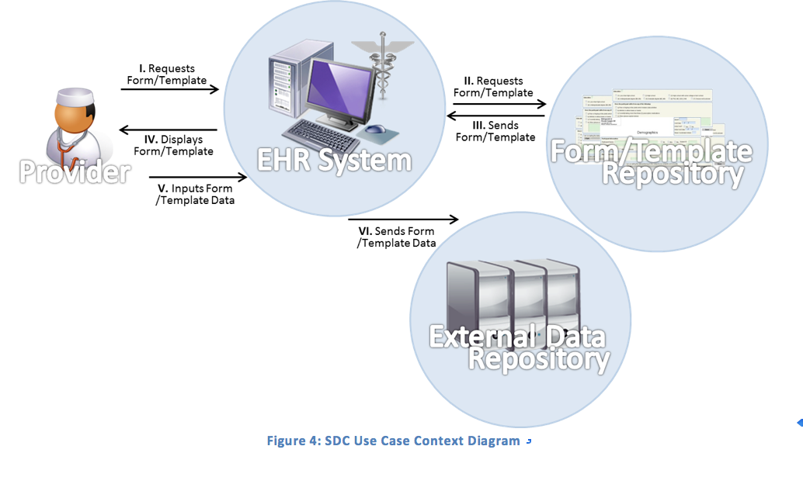
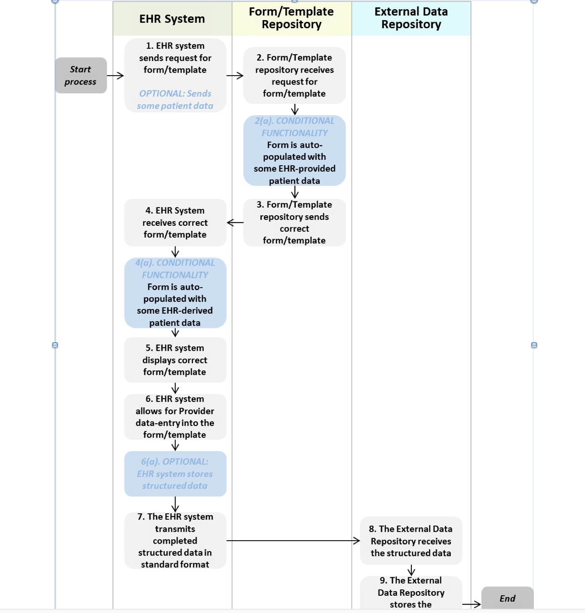
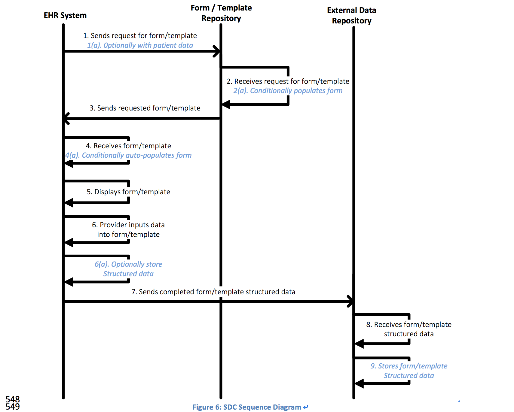
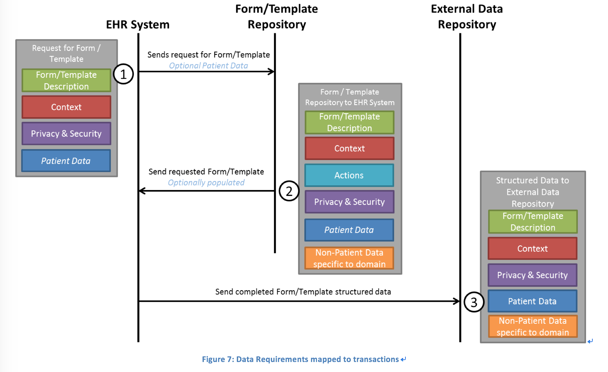

# SDC 用例文档

## 目录大纲

1.0 前言和介绍   
2.0 项目概述       
2.1 项目存在的挑战        
3.0 用例的范围      
4.0 价值     
5.0 用例的假设     
6.0 前置条件       
7.0 后置条件        
8.0 角色    
9.0 用例图  
10.0 场景     
10.1 用户故事       
10.1.1 患者安全用户故事     
10.1.2 需上报的疾病用户故事      
10.1.3 临床研究用户故事       
10.1.4 不良事件、医疗设备用户故事         
10.1.5 determination of coverage      
10.2 活动图      
10.2.1 基本流程      
10.3 功能需求     
10.3.1 信息交换需求     
10.3.2 系统需求     
10.4 序列图     
11.0 数据集需求     
11.1 表单、模板描述的数据元       
11.2 语境相关数据元      
11.3 活动和表达的数据元     
11.4 隐私安全相关数据元      
11.5 患者相关数据元      
12.0 风险、问题和困难       
附录     
a 相关用例      
b 已知的工作      
c 词汇和简称            
d Actions & Expression的详细列表          
        


### 5.0 用例的假设
* 医疗机构必须要有EHR 系统
* 医疗机构必须知道且能够访问可用的表单和模板
* 医疗机构知道如何选择待完成的表单、模板
* 已经定义好了CDE 表单 模板的开发流程
* 外部数据存储库可用来存储结构化数据
* 只有某些终端用户能够有权限访问外部数据存储库中的数据
* 隐私安全策略
* 必要的访问权限和登录授权机制
* 能够以SDC结构化格式来访问和获取表单、模板
* 使用标准IT协议来处理反馈和错误处理消息
* 外部数据存储库可以是：1 在给表单提供数据的EHR系统所在的医疗机构(例如某些临床研究的场景) 2、数据的用户所在的机构(例如公共卫生机构从医疗机
    构获取数据) 3 、在上述两类(数据提交者和数据使用者)机构之外(单独的疾病登记库)。
* EHR系统能够存储采集到的数据，并能够将数据与某个病人关联起来，能够与既往的某次就诊关联起来。
* 某些情况下，数据必须以连续记录的方式来采集和记录，这就要求随后采集的数据要与之前采集的数据进行比对以确保准确性

### 6.0 前置条件

* 根据地区、机构、患者隐私授权的要求，医疗机构和最终用户能够以安全的方式访问临床数据
* 能够从表单存储库中访问和获取按照表单结构标准定义的表单
* EHR系统能够检索和战士从外部获取的标准化格式的表单
* EHR 系统能够保证跨医疗机构、跨最终用户系统、跨数据存储库和本地服务的统一的、适当的和准确的信息交换，使用但不限于以下的手段：
    * 鉴别和认证用户
    * 鉴别和确定医疗服务的provider
    * 实施数据访问授权策略
* 对于自动赋值，EHR系统在抽取自己的数据库中数据时能够保留数据项之间的关联和完整性。
    * 比如收缩压和舒张压是单独的两个数据元，但在采集时应该关联起来，任何编辑动作都应该保持关联。
* 对于自动赋值，EHR系统要能够追踪EHR系统所存储和抽取数据的变更。

### 7.0 后置条件

* 完成后的表单、模板数据存储在外部的数据存储库中，包括相应的审计信息
    * 需要的时候，可以将采集的数据存储在EHR中并将其与病人、病人既往诊疗过程的病例关联起来
* 可以通过外部数据存储库访问从EHR系统中传输的表单、模板的结构化数据
* 最终用户，当然也可能是提交数据的机构，能够以安全的方式访问存储在外部数据库中的临床信息    
* 有关数据访问授权、数据所有权、数据利用的法律和管理问题可以在任何处理、获取患者数据的系统中实施
* 从EHR系统中发送的已完成的表单数据的保真度是靠外部数据库来保证的

###  8.0 角色

| 角色 | 系统 | 系统角色 |
| ---- | ----- | --- |
| 医疗机构 | EHR系统 | 确定表单；输入数据到表单；回顾和保存已完成的表单 |
| ---- | EHR 系统 | 发送表单请求；获得表单；展示表单；自动填充表单；存储已完成表单；发送已完成表单 |
| ---- | 表单 模板库 | 收到表单请求；自动填充表单；发送表单 |
| ---- | 外部数据存储库 | 接收已完成的表单；存储已完成的表单 |

### 9.0 用例图



#### 10.1.3 临床研究 用户故事

某医生正在参与一项针对她的一些病人的某项临床研究，按照临床研究设计方案来选择患者，患者每次来访，医生都必须采集一些额外的数据项和评估数据。后续
的说明使得医生呢哥哥确定潜在的合格的患者，手动排除患者，每当有符合条件的患者，EHR系统就回告知医生，同时提供一个数据提交的链接，以及需要采集的
额外数据。医生请求和检索一个待完成的评估表单，EHR系统将表单展示给医生，自动填充了EHR中已经存在的相应数据，同时医生也能够通过EHR系统来回顾或删除、、修正
数据，添加额外信息。一旦数据完全的准确的录入以后，数据暂存在EHR系统之中，定期地传输到study organizer的数据仓库。传输完成后，医生和数据仓库均会得到传输完成的通知。

归档库只采集可读的相关的文档副本：1、用于自动填充表单的导出的文档；2、自动填充好了的表单结构化数据；3、最终提交的表单结构化数据以及医疗机构补充的额外数据
。归档库可能是由EHR来维护，也可以是独立于EHR的，只要归档库归site管理。可以是托管在内部或外部的第三方。归档库作为研究的
authorized electronic source record。实现监管、审计、monitoring, auditing, inspection, and source document verification.  

### 10.2 活动图




#### 10.2.1 基本流程

| 步骤 | 角色 | 系统角色 | 事件描述 | 输入 | 输出 | 互联互通/系统步骤 |
| ---- | ---- | ---- | ---- | ----- | ---- | ---- |
| 1 | provider | 确定需要的表单 | 医生从EHR系统向表单库发送表单请求 | 启动 | 表单请求 可选项(某些患者数据) | 互联互通 |
| 2 | 表单库 | 收到表单请求 | 表单库收到EHR系统的表单请求 | 表单请求 | 正确的表单 可选项(某些患者数据) | 互联互通 |
| 2a | 表单库 | 自动填充表单 | 表单库自动填充表单 | 正确的表单(某些患者数据) | 自动填充好的表单 | 系统步骤 |
| 3 | 表单库 | 发送表单 | 表单库向EHR系统发送所请求的表单 | 正确的表单 | 正确的表单 | 互联互通 |
| 4 | EHR系统 | 接收表单 | EHR系统接收来自表单库的表单 | 正确的表单 | 正确的表单 | 互联互通 |
| 4a | EHR系统 | 自动填充表单 | EHR系统自动填充来自表单库的表单 | 正确的表单 | 自动填充好的表单 | 系统步骤 |
| 5 | EHR系统 | 展示表单 | EHR系统在系统内展示拿到的表单 | 正确的表单 | 可编辑的表单 | 系统步骤 |
| 6 | provider | 向表单输入数据 | 医生在EHR系统内向表单中录入数据 | 可编辑的表单 | 已完成的表单 | 系统步骤 |
| 6a | EHR系统 | 存储已完成的表单结构化数据 | EHR系统存储结构化数据 | 标准格式的结构化数据 | 存储结构化数据 | 系统步骤 |
| 7 | EHR系统 | 发送已完成的表单数据 | EHR系统向外部数据存储库传输已完成的结构化表单数据 | 已完成的表单结构化数据和必要的元数据 | 打包好的结构化数据 | 互联互通 |
| 8 | 外部数据存储库 | 接收表单数据 | 外部数据存储库接收来自EHR系统的结构化数据 | 打包的结构化数据 | 按照存储库格式的结构化数据 | 互联互通 |
| 9 | 外部数据存储库 | 存储已完成表单的结构化数据 | 外部存储库存储按照标准格式的结构化数据 | 按照存储库格式的结构化数据 | 已完成存储的结构化数据 | 系统步骤 |

### 10.3 功能需求

#### 10.3.1  信息交换需求

| 发送方 | 动作 | 交互名称 | 动作 | 接收方 |
| ---- | ---- | ---- | ----- | ---- |
| EHR系统 | 发送 | 表单请求 | 接收 | 表单库 |
| EHR系统 | 发送 | 伴有患者数据的表单请求 | 接收 | 表单库 |
| 表单库 | 发送 | 表单 | 展示 | EHR系统 |
| 表单库 | 发送 | 自动填充了患者数据的表单 | 接收 | EHR系统 |
| EHR系统 | 发送 | 已完成的表单结构化数据 | 接收 | 外部数据存储库 |

#### 10.3.2  系统要求

| 系统 | 系统要求 |
| ----- | ---- |
| EHR系统 | 能够选择表单 |
| EHR系统 | 根据访问控制协议来创建和打包患者数据 |
| EHR系统 | 展示表单时根据EHR中的患者数据自动填充 |
| EHR系统 | 展示可编辑的表单 |
| EHR系统 | 将标准格式的结构化数据整合到表单中 |
| EHR系统 | 存储标准化格式的结构化数据 |
| 表单库 | 确定正确的所请求的表单 |
| 表单库 | 根据患者数据为所检索的表单赋值 |
| 外部数据存储库 | 存储标准格式的结构化数据 |
| 外部数据存储库 | 根据访问授权，允许最终用户查询结构化数据 |


### 10.4 序列图



###  11.0 数据需求


详情请参考本文件同级目录中的structured data capture dataset requirement.xlsx

## 参考资料

1、[Structured Data Capture Initiative Standards and Interoperability Framework  Use Case 5/30/2013](http://wiki.siframework.org/file/view/SIFramework_Structured%20Data%20Capture_Use%20Case%20v1.0.doc/555904553/SIFramework_Structured%20Data%20Capture_Use%20Case%20v1.0.doc)

